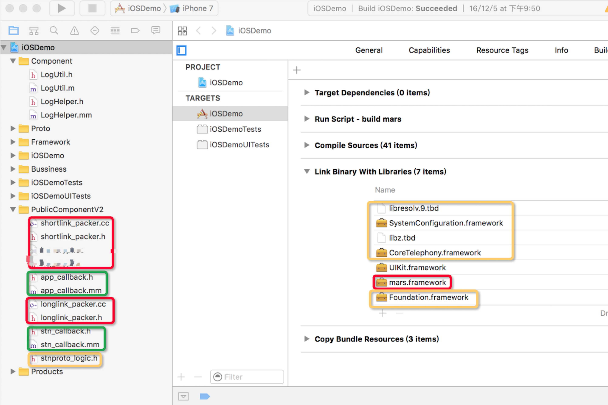

# 业务背景
2018下旬在广汽中心和腾讯合作做网约车项目，当时软凌移动端的负责人。我们开发过程中涉及到的第三方组件由于项目背景的缘故，我们只能使用腾讯的，今天我们来记录下项目中使用到的日志功能，如何做到高性能的本地日志存储。
> 对于移动开发者来说，当用户反馈或者我们发现问题时，我们需要联系用户，用户答应配合后，然后修改代码打开日志重新编包让用户试图重现问题，重现之后才能继续排查。当然这个比较适合做sdk的同学，
对于to C 端的app是很难做到的，但是在我们开发测试过程中本地日志可是很关键（本地日志是为了互补crash 收集）。

# Mars介绍
mars 是微信官方的终端基础组件，是一个使用 C++ 编写的业务性无关，平台性无关的基础组件。接入 mars 之后，开发一个应用只需要把开发重心放在业务层和 UI 层上。
### mars 架构图


1. comm：可以独立使用的公共库，包括 socket、线程、消息队列、协程等；
2. xlog：高可靠性高性能的运行期日志组件；
3. SDT： 网络诊断组件；
4. STN： 信令分发网络模块，也是 Mars 最主要的部分。

##  xlog 特性
1.流畅性 引入mmap来保证高性能和高可靠性IO。
2.完整性 使用流式压缩加密写入log中间buffer的mmap中，当达到一定大小在写入disk中，减少日志文件体积。
3.容错性 不丢失任何一行日志
4.安全性 日志规范化+加密算法


# xlog使用
1. 下载 CMake，并正常安装。 [传送门](https://cmake.org/download/)
2. 安装完成之后，使用以下指令创建/usr/local/bin下 CMake 的软链接。

```
sudo "/Applications/CMake.app/Contents/bin/cmake-gui" --install
```

3. 重新打开 Terminal，即可正常使用 CMake 的各种指令了。也可以在应用程序列表中使用带 GUI 的 CMake 工具。
4. 安装python2.7及以上
5. 执行python build_ios.py 

| 文件名	  | 描述  |
|:------------- |:---------------:|
| cmake_build/Darwin.out/mars.framework	| mars framework
| libraries/mars_android_sdk/jni/longlink_packer.cc.rewriteme | 长连接协议可扩展部分，使用前请先改名为 longlink_packer.cc，如若想自定义长连接包头以及加解包，重写该文件。
| libraries/mars_android_sdk/jni/longlink_packer.| 编译 longlink_packer.cc 需要使用的头文件，请勿修改。
     libraries/mars_android_sdk/jni/stnproto_logic.h	   |  longlink_packer.cc 中 SetClientVersion 函数的声明。如若删除 SetClientVersion 函数，请同时删除该文件。
libraries/mars_android_sdk/jni/shortlink_packer.cc.rewriteme	| 短连接协议可扩展部分，使用前请先改名为 shortlink_packer.cc，如若想自定义短连接包头(HTTP Head)，重写该文件。
libraries/mars_android_sdk/jni/shortlink_packer.h	 | 编译 shortlink_packer.cc 需要使用的头文件，请勿修改。

> 以下接入部分可参考 mars/samples/iOS 和 mars/samples/Mac。 强调：所有直接调用 C/C++接口的 Objc 源文件必须是 .mm 后缀，不能是.m 后缀。

接入项目


其中红色部分为 mars 提供的部分，黄色部分是使用 mars 需要的系统库，绿色部分为需要开发者自行实现的 callback 部分。注意：链接的时候要把生成的 framework 移到别的位置再链接，不要直接用mars/mars/cmake_build/iOS/Darwin.out 目录。因为如果再次执行编译脚本会进行一次 clean, 会删除此目录下的文件。
# xlog使用方法
1. 初始化和反初始化
需要在main.mm文件初始化

```
NSString *logPath = [[NSSearchPathForDirectoriesInDomains(NSDocumentDirectory, NSUserDomainMask, YES) objectAtIndex:0] stringByAppendingString:@"/log"];    
    NSLog(@"logPath: %@", logPath);
    //不备份日志路径
    const char* attrName = "com.apple.MobileBackup";
    u_int8_t attrValue = 1;
    setxattr([logPath UTF8String], attrName, &attrValue, sizeof(attrValue), 0, 0);

#if DEBUG
    xlogger_SetLevel(kLevelDebug);
    appender_set_console_log(true);
#else
    xlogger_SetLevel(kLevelInfo);
    appender_set_console_log(false);
#endif
    /*
     * 设置日志目录、日志文件前缀
     * 特别强调一点pubkey，设置后才会对日志进行加密，若Debug模式下不希望加密，可以设置空""，pubkey在decode_mars_crypt_log_file.py脚本中。
     */
    appender_open(kAppednerAsync, [logPath UTF8String], "fileNameprefix", "pubkey"); 
```

需要在APP终止方法`applicationWillTerminate `中反初始化

```
appender_close();
```

2. 打印日志

> LOG_DEBUG(@"模块名称", @"日志描述：%@", 需要打印的具体信息); //开发模式
> LOG_INFO(@"模块名称", @"日志描述：%@", 需要打印的具体信息); //发布模式

## 解析xlog文件
1. 第一种通过下载安装pyelliptic1.5.7 
2. 第二种可以在samples 里面找到PublicComponentV2文件夹

执行python decode_mars_log_file.py “xlog文件” 得到---xlog.log文件，即可以打开

有问题可以联系[Email](mailto:ep_chengsun@aliyum.com)